## 의존 관계

```mermaid
graph LR

App
InputHandler
InputView
OutputView
MainOrder

subgraph Calculator
    direction LR
    OrderCalculator
    DiscountCalculator
    BasicCalculator
    Calc
end

InputValidator
OutputParser
DomainParser
DomainValidator

App ---> InputHandler
App ----> ResultHandler

InputHandler ---> InputView
InputHandler ---> OutputView
InputHandler ---> MainOrder
InputView ---> InputValidator
OutputView --> OutputParser

MainOrder ---> DomainParser
MainOrder ---> DomainValidator

BasicCalculator ---> Calc
DiscountCalculator ---> |논리적 상속| BasicCalculator
DiscountCalculator ---> Calc
OrderCalculator ---> Calc
OrderCalculator ---> |논리적 상속| DiscountCalculator
OrderCalculator ---> |논리적 상속| BasicCalculator

ResultHandler ---> OutputView
ResultHandler ---> Calculator

style App fill:#464
style InputHandler fill:#464
style ResultHandler fill:#464

style InputView fill:#644
style OutputView fill:#644

style MainOrder fill:#446
style DiscountCalculator fill:#224
style BasicCalculator fill:#224
style OrderCalculator fill:#224
style DomainValidator fill:#224
style DomainParser fill:#224

```


## 기능 요구사항 해석 관련
- `총주문 금액`과 구별되는 `할인 전 총주문 금액`이라는 별도 표현이 존재
    - 할인 전 1만원 이상이고 할인 후 1만원 미만이 되는 경우의 문제
        - `ad-hoc`으로 해결할 수 있지만 논리적이지 않음
    - 배달의 민족 어플리케이션 기준, `총주문 금액`은 할인 전 금액을 나타내는 표현임
    - 따라서 `총주문 금액`은 `할인 후 예상 결제 금액`이 아닌 `할인 전 총주문 금액`으로 가정함

- `음료만 주문 시, 주문할 수 없습니다.`와 `메뉴는 한 번에 최대 20개까지만 주문할 수 있습니다.`의 경우
    - 이외의 에러 처리의 경우 명시적으로 다시 입력 받을 것을 요구하는데 반해 '고객에게 안내할 이벤트 주의 사항'은 예외 처리를 요구하지 않음.
    - `사용자가 잘못된 값을 입력할 경우 throw문을 사용해 예외를 발생시킨다. 그런 다음, "[ERROR]"로 시작하는 에러 메시지를 출력하고 해당 부분부터 입력을 다시 받는다.`에 근거하여 재입력을 받음.

## 추가 목표(개인)
- 프로젝트의 추가적인 목표는 아래와 같은 결과를 생성하는 것이다.
```javascript
{
    date: 3,
    menus: {
        appetizer: {},
        main: { '티본스테이크': 1, '바비큐립': 1 },
        dessert: { '초코케이크': 2 },
        drink: { '제로콜라': 1 }
    },
    originalTotal: 142000,
    reward: { '샴페인': 1 },
    benefitInfo: {
        weekday: 4046,
        weekend: 0,
        special: 1000,
        christmas: 1200,
        reward: 25000
    },
    benefitValue: 31246,
    discountedTotal: 135754,
    badge: '산타'
}
```
- `JSON`으로 변환되었을 때, 손실이 없도록 구현
- `menus`의 카테고리를 분류한 상태로 상태를 관리
    - 실제 서비스 시, 섹션/스테이션 별로 요리가 진행됨을 고려할 때 분류가 이루어지는 것이 합리적
    - 분류하지 않고 상태로 관리할 시에도 주중, 주말 할인을 계산하기 위해 1회 전체 순회해야 함
- 결과는 한 번에 계산
    - 각 항목의 계산 메서드를 `App` 내에서 분리할 수 있지만 실익이 크지 않음
    - 현재 구현 상태도 필요 시 분리하기에 까다롭지 않음
- `Utility` 기능 성격이 강한인 *오브젝트의 value 합계*와 *배열의 합계*는 별도로 분리함
    - `Calculator`를 조상 클래스로 만들 경우 이후 추가될 클래스에 불필요한 상속 연쇄 가능성
- `MainOrder` 클래스는 상태 관리만을 목적으로 하고, `OrderCalc`에서 실질적인 연산을 진행(상태 영향 x)
- '배지'의 지위
    - '배지'는 '혜택 금액'에 의존하므로 관리할 필요가 없는 것처럼 보임(단순 view 로직으로 판단됨) 
    - 하지만 추후 이후 이벤트에 활용을 고려하여 `result`에서 '필드'로 취함

# 구현 목표 기능

## 🔑 기본 주문 / 인스턴스 O
### 중점 사항
- 도메인 영역으로 상태를 관리하는 영역
### 상태
- 🔓❄️ 방문 예정일
- 🔓❄️ 주문 정보(메인, 디저트, 에피타이저, 음료)
### 기능
    - [ ] 받은 방문 예정일을 검증하는 기능
    - [ ] 받은 주문 정보를 검증하는 기능 (메인의 존재)
        - [ ] 개별 주문을 검증하는 기능 (메뉴 이름, 수량)
    - [ ] 받은 주문 정보에 대해 카테고리를 나누어 오브젝트로 저장한 뒤 set하는 기능

## 🔑 기본 계산기 / 인스턴스 X
### 중점 사항
- 도메인 영역으로 방문 예정일과 메뉴를 받아 기본 사항을 계산하는 영역
- 할인 전 총주문금액 계산, 메뉴의 총액 계산, 이벤트 충족 여부 계산를 계산하는 기능을 함
### 기능
    - [ ] 할인 전 총주문 금액 합계를 반환하는 기능
    - [ ] 메뉴와 수량의 오브젝트를 받아, 메뉴의 총주문 금액을 계산하는 기능
    - [ ] 주문금액이 이벤트 조건을 충족하는지 확인하는 기능

## 🔑 할인 계산기 / 인스턴스 X
### 중점 사항
- 기본 계산기의 메서드를 전달(상속) 받음
- 도메인 영역으로 방문 예정일과 메뉴를 받아 할인 정보를 계산하는 기능
- 외부에 노출되지 않는 메서드로 구성
- 추후 할인의 종류에 따른 혜택 추가를 고려해 퍼블릭 메서드 운용
### 기능
    - [ ] 할인된 금액을 계산하는 기능
        - [ ] 주중 할인 금액을 계산하는 기능
        - [ ] 주말 할인 금액을 계산하는 기능
        - [ ] 크리스마스 디데이 할인 금액을 계산하는 기능
        - [ ] 특별 할인 금액을 계산하는 기능

## 🔑 주문 계산기 / 인스턴스 X
### 중점 사항
- 기본 계산기의 메서드를 전달(상속) 받음
- 혜택(할인, 증정, 배지)과 금액(할인 전, 할인 후) 계산하는 기능
- 도메인 지식이 없는 계산 영역은 Util에서 처리
- 유사한 항목도 항목에 따라 별도의 메서드를 운용
    - 다른 인자에 대한 동일한 로직이더라도 이 지식을 컨트롤러로 전가하지 않기 위함 
- 외부에 노출되는 메서드의 인자는 '메인 오더'로 고정
    - 중간에 계산된 결과를 인자로 받으면 '메인 오더'의 상태가 변했을 때 구하는 값이 잘못된 값에 의존할 수 있음
    - 환경에 따라 다르겠지만, 실제 서비스 환경에서는 캐싱이 이루어질 수 있음
### 기능
    - [ ] 증정품을 계산하는 기능
    - [ ] 혜택 내역을 계산하는 기능
    - [ ] 전체 혜택의 금액을 계산하는 기능
    - [ ] 할인 후 예상 결제 금액을 계산하는 기능
    - [ ] 전체 혜택의 금액에 따라 배지를 계산하는 기능

## 🎮 결과 핸들러
### 중점 사항
- 주문 계산기를 통해 필요 정보를 결과로 변환하고 이에 대한 출력을 담당하는 객체
- 결과는 반드시 상태로 관리하지 않고 계산해서 내보냄
    - 별도 상태로 관리할 경우, 중간에 **주문**을 변경하는 경우에 상태가 즉각적으로 반영되지 않음
    - 결과의 무결성을 보장하기 위해서는 매번 계산을 실행해야 함 
### 기능
    - [ ] 결과에 필요한 내용을 계산하여 결과 객체로 만드는 기능
    - [ ] 결과를 출력하는 기능


## 🎮 입력 핸들러
### 중점 사항
- 입력을 받고 검증하고 가공한 뒤 도메인에 넘기는 흐름을 통제하는 기능
### 기능
    - [ ] 방문 예정일 입력을 받는 기능
        - [ ] `Console.readLineAsync()` 메서드를 활용한 입력 받기
        - [ ] 기본 주문생성 시도
        - [ ] 실패 시 출력 후 재시도
    - [ ] 메뉴 입력을 받는 기능
        - [ ] `Console.readLineAsync()` 메서드를 활용한 입력 받기
        - [ ] 기본 주문에 메뉴 추가 시도
        - [ ] 실패 시 출력 후 재시도

## 👀 입력 뷰
### 중점 사항
- 사용자로부터 입력을 받아 핸들러에게 전달하는 기능
### 기능
    - [ ] 방문 예정일 입력 정보를 받는 기능
        - [ ] 입력을 받는 기능
        - [ ] 자료형 검증을 실행하는 기능
        - [ ] 형을 변환하는 기능
    - [ ] 메뉴 입력 정보를 받는 기능
        - [ ] 입력을 받는 기능
        - [ ] 자료형 검증을 실행하는 기능
        - [ ] 형을 변환하는 기능

## 👀 출력 뷰
### 중점 사항
- 도메인으로부터 받은 지식을 가공 및 출력하는 흐름을 통제하는 기능
### 기능
    - [ ] 방문 예정일 문구를 출력하는 기능
    - [ ] 할인 전 총 주문 금액을 계산 후 출력하는 기능
    - [ ] 증정 메뉴를 출력하는 기능
    - [ ] 혜택 내역을 출력하는 기능
    - [ ] 혜택 금액을 출력하는 기능
    - [ ] 할인 후 결제 예정액을 출력하는 기능
    - [ ] 배지를 출력하는 기능
    - [ ] 에러 메시지를 출력하는 기능

## 🔑🔧 도메인 파서
### 기능
    - [ ] 문자열로 이루어진 *주문 메뉴*와 *수량*의 배열을 받아
        - [ ] 메뉴를 카테고리 별로 분류하고
        - [ ] 카테고리에 메뉴: 수량의 형태로 저장한 뒤,
        - [ ] 오브젝트의 형태로 반환하는 기능

## 🔧 출력 파서
### 기능
    - [ ] 음식의 Key-Value쌍이 주어질 때, 문자열로 반환하는 가공 함수
    - [ ] 혜택의 Key-Value쌍이 주어질 때, 문자열로 반환하는 가공 함수
    - [ ] 증정품 메뉴의 Key-value 쌍이 주어질 때, 문자열로 반환하는 가공 함수
    - [ ] 금액이 주어질 때, 따옴표와 단위를 넣어서 반환하는 함수
    - [ ] 금액이 주어질 때, 이에 해당하는 배지를 반환하는 함수
    - [ ] 배열의 원소를 결합하여 연결된 문자열로 만드는 기능
    - [ ] 배열의 원소를 결합하여 줄바꿈이 있는 문자열로 만드는 기능

## 🔧 계산 유틸
### 중점 사항
- 도메인 부문에서 코드 가독성을 저해하는 단순 계산 영역을 순수 함수화
- 계산을 제외한 불필요한 도메인 지식 최소화
### 기능
    - [ ] 아이템 계산
        - [ ] 주어진 오브젝트의 Key-Value를 순회하며 금액 합계를 반환하는 기능
        - [ ] 배열의 합을 반환하는 기능
    - [ ] 날짜 계산
        - [ ] 방문 예정일이 주말인지 확인하는 기능
        - [ ] 방문 예정일이 특별 할인일에 속하는지 확인하는 기능
        - [ ] 추가 이벤트 금액에 곱해줄 계수를 계산하는 기능

## 🔧 검증 유틸
### 기능
    - [ ] 입력 검증
        - [ ] 방문일 검증
            - [ ] 방문일이 정수인지 검증
        - [ ] 주문 검증
            - [ ] 주어진 메뉴가 각 메뉴 별로 1개의 `-`를 포함하는지 확인
            - [ ] 주어진 메뉴의 수량이 정수인지 확인
            - [ ] 주어진 메뉴의 이름에 중복이 없는지 확인
    - [ ] 도메인 검증
        - [ ] 방문일 검증
            - [ ] 1에서 31 사이의 정수인지 확인
        - [ ] 주문 검증
            - [ ] 개별 메뉴 검증
                - [ ] 메뉴 이름이 등록된 메뉴인지 검증
                - [ ] 메뉴의 수량이 1 이상의 정수인지 검증
            - [ ] 메뉴의 수량 합이 20이하인지 검증
            - [ ] 메뉴가 음료 이외의 카테고리를 포함하는지 검증
        